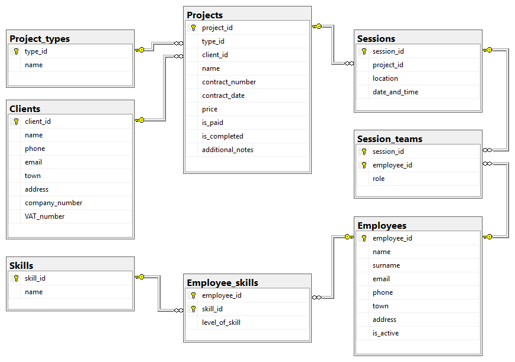

📸 Photo Studio Management Database
==================================

A relational database project developed for the **Databases** course of the **Mobile and Web Technologies** major at the **[Department of Informatics](https://informatics.ue-varna.bg)** of the **[University of Economics — Varna](https://ue-varna.bg)**.

This repository contains the design, implementation, and querying scripts for a Photo Studio Management Database. The system is designed to facilitate the management of photography/videography projects, client relations, session scheduling, and employee skill-based allocation.

📖 Overview
----------

**VD Studio** is a regional photo studio operating primarily within Northeastern Bulgaria. To optimize its business processes and scale its operations, the studio requires a robust database system to effectively track its client engagements and manage daily workflows.

The database handles:

- **Client Management:** Differentiates between natural persons and legal entities, storing appropriate contact and legal details (e.g., VAT number, company number).
- **Project Tracking:** Records contract details, project types (wedding packages, graduation yearbooks, etc.), pricing, and completion status.
- **Session Scheduling:** Breaks down projects into specific sessions with designated locations and timestamps.
- **Human Resources & Skills:** Maintains a roster of employees, tracking their specific skills (Photography, Lighting, Drone Operation, etc.) and proficiency levels (1–5).
- **Team Allocation:** Assigns employees to specific sessions based on their roles and availability.

A deeper description of the database design, entity-relationship model, and the logic behind the SQL queries is provided in the project **term paper** in both [English](./term-paper-EN.pdf) and [Bulgarian](./term-paper-BG.pdf).

🗄️ Database Architecture
-----------------------

The relational model consists of 8 interconnected tables conceptually designed and normalized:

1. **`Clients`**: Stores client personal and corporate information.
2. **`Project_types`**: Lookup table for project categories.
3. **`Projects`**: Central table linking clients to their contracted services.
4. **`Sessions`**: Individual shooting sessions tied to a project.
5. **`Employees`**: Studio personnel details and active status.
6. **`Skills`**: Lookup table for available professional skills.
7. **`Employee_skills`**: Associative entity mapping employees to skills with a proficiency level.
8. **`Session_teams`**: Associative entity assigning employees to sessions in specific roles.

🛠️ Technologies & Tools Used
---------------------------

- **SQL Dialect:** Transact-SQL (T-SQL)
- **RDBMS:** Microsoft SQL Server
- **Concepts Applied:**
    - DDL (Data Definition Language)
    - DML (Data Manipulation Language)
    - `JOIN` clauses
    - aggregation functions
    - subqueries
    - transactions
    - error handling (`TRY...CATCH`)

📊 Key Queries & Reports
-----------------------

The database includes comprehensive SQL scripts covering various CRUD operations and business scenarios:

1. **[Unpaid Projects Report](./queries/01-unpaid-projects-report.sql):** Tracks financial receivables.
2. **[Projects Filtered by Type](./queries/02-projects-filtered-by-type.sql):** Filters projects (e.g., graduation yearbooks) for workload planning.
3. **[Sessions without Assigned Teams](./queries/03-sessions-without-assigned-teams.sql):** Identifies sessions lacking an assigned team.
4. **[Total Monthly Income for the Current Year](./queries/04-total-monthly-income-for-the-current-year.sql):** Calculates total chronological revenue for the current year.
5. **[Average Revenue by Project Type](./queries/05-average-revenue-by-project-type.sql):** Ranks the most profitable service categories.
6. **[Top Clients for Loyalty Program](./queries/06-top-clients-for-loyalty-program.sql):** Identifies strategic clients (those with total turnover above the average).
7. **[Available Employees by Skill and Date](./queries/07-available-employees-by-skill-and-date.sql):** Finds free personnel (e.g., photographers) on specific dates to handle force majeure situations.
8. **[New Project Registration](./queries/08-new-project-registration.sql):** Inserts new project data safely.
9. **[Price Conversion to Euro](./queries/09-price-conversion-to-euro.sql):** Updates unpaid project prices by applying conversion from BGN to EUR.
10. **[Project Cancellation](./queries/10-project-cancellation.sql):** Safely cascades the deletion of a project and its associated sessions and teams using SQL `TRANSACTION` blocks.

👨🏻‍💻 Authors
---------

- [Victor Marinov](https://github.com/vicmarinov)
- [Denis Demir](https://www.instagram.com/dns_29.10)